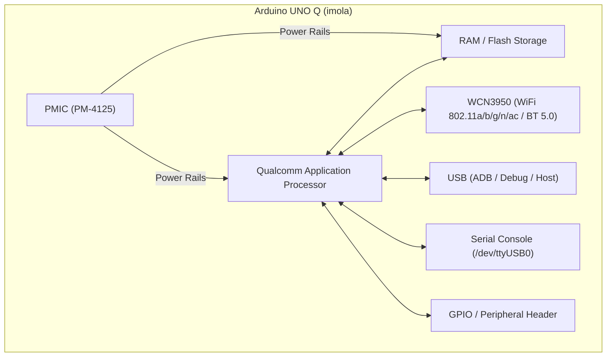
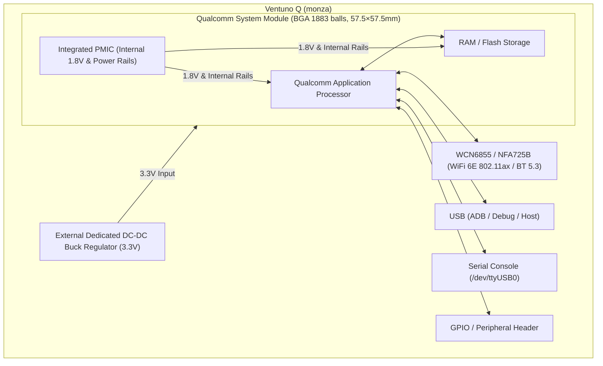

# Supported Hardware

## Yocto Machines (SoMs)

| Machine               | Status                      |
|-----------------------|----------------------------|
| portenta-x8           | In Production              |
| portenta-x9           | Internal Use / Prototype   |
| imx8mp-astrial        | Internal Use / Prototype   |
| raspberrypi4-64       | Internal Use / Prototype   |
| imola (Arduino UNO Q) | In Production              |
| monza (VentUNO Q)     | In Production              |

## Carrier Boards

| Carrier Board              | Compatible Machines | Status        |
|----------------------------|---------------------|---------------|
| Portenta Breakout Board    | portenta-x8         | In Production |
| Portenta Max Carrier       | portenta-x8         | In Production |
| Portenta Mid Carrier       | portenta-x8         | In Production |
| Portenta Hat Carrier       | portenta-x8         | In Production |

## Camera Modules

All cameras use 2-lane MIPI-CSI interface.

| Camera Module              | Compatible Machines | Resolution | ISP | Status                            |
|----------------------------|---------------------|------------|-----|-----------------------------------|
| OV5640                     | portenta-x8         | 5MP        | Yes | Supported (acceptable perf.)      |
| OV5647                     | portenta-x8         | 5MP        | No  | Supported (poor perf.)            |
| IMX219                     | portenta-x8         | 8MP        | No  | Supported (poor perf.)            |
| IMX477                     | portenta-x8         | 12.3MP     | No  | Supported (poor perf.)            |

## DSI Display Panels

| Display Panel              | Compatible Machines | Resolution  | Size    | Touchscreen | Status        |
|----------------------------|---------------------|-------------|---------|-------------|---------------|
| EDT ET035012DM6            | portenta-x9         | 320×240     | 3.5"    | FT5x06      | Supported     |
| EDT ETM0350G0DH6           | portenta-x9         | 320×240     | 3.5"    | FT5x06      | Supported     |
| EDT ETM043080DH6GP         | portenta-x9         | 480×272     | 4.3"    | FT5x06      | Supported     |
| EDT ETM0430G0DH6           | portenta-x9         | 480×272     | 4.3"    | FT5x06      | Supported     |
| EDT ET057090DHU            | portenta-x9         | 640×480     | 5.7"    | FT5x06      | Supported     |
| EDT ETM0700G0DH6           | portenta-x9         | 800×480     | 7.0"    | FT5x06      | Supported     |
| EDT ETM0700G0BDH6          | portenta-x9         | 800×480     | 7.0"    | FT5x06      | Supported     |
| EDT ETML0700Y5DHA          | portenta-x9         | 1024×600    | 7.0"    | FT5x06      | Supported     |
| EDT ETMV570G2DHU           | portenta-x9         | 640×480     | 5.7"    | FT5x06              | Supported     |
| Jadard EK79202D            | portenta-x8         | Custom      | Custom  | atmel,atmel_mxt_ts  | Supported     |
| Sitronix ST7701            | portenta-x8         | Custom      | Custom  | goodix,gt911        | Supported     |

## WiFi/Bluetooth Modules

| Module                     | Compatible Machines | WiFi Standard     | Frequency Bands     | Bluetooth | Status                    |
|----------------------------|---------------------|-------------------|---------------------|-----------|---------------------------|
| Murata 1DX                 | portenta-x8         | 802.11b/g/n       | 2.4GHz              | BT 4.2    | In Production             |
| NXP IW612                  | portenta-x9         | 802.11ax (WiFi 6) | 2.4GHz, 5GHz        | BT 5.4    | Internal Use / Prototype  |
| WCNBN3536A (WCN3950)       | imola               | 802.11a/b/g/n/ac  | 2.4GHz, 5GHz        | BT 5.0    | In Production             |
| Qualcomm NFA725B (WCN6855) | monza               | 802.11ax (WiFi 6E)| 2.4GHz, 5GHz, 6GHz  | BT 5.3    | In Production             |

## Secure Elements

| Module                     | Compatible Machines | Type         | Status        |
|----------------------------|---------------------|--------------|---------------|
| NXP SE05X                  | portenta-x8         | I2C          | In Production |

## Block Diagrams

### Arduino UNO Q (imola)

### Ventuno Q (monza)

